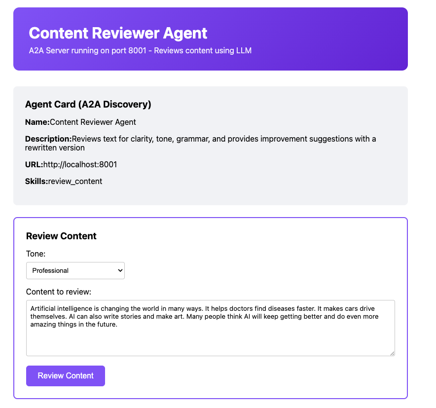
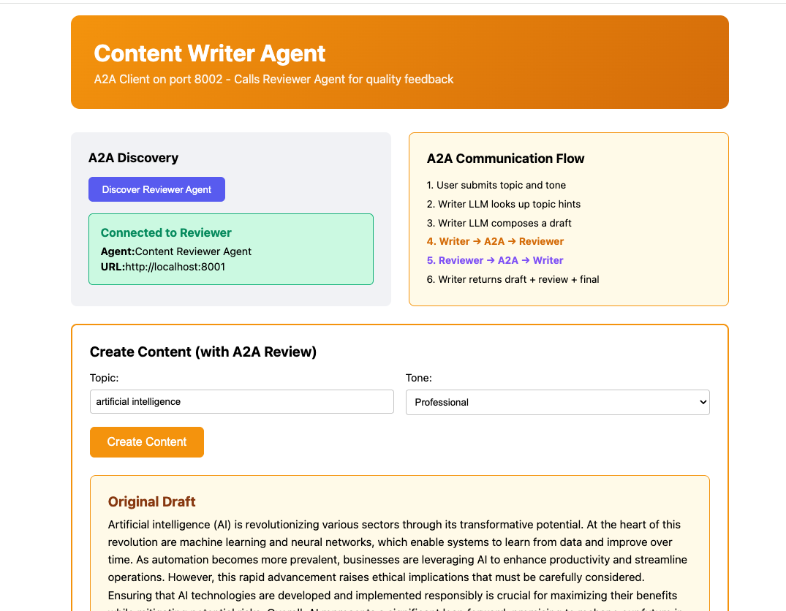

# Content Writer & Reviewer A2A Example

A simple example demonstrating **A2A (Agent-to-Agent)** communication between two byllm agents in separate Jac applications. Unlike basic calculation tasks, both agents here genuinely leverage LLM capabilities — one for creative writing and the other for content analysis.

## Architecture

```
┌────────────────────────────────────┐         ┌────────────────────────────────────┐
│     WRITER APP (port 8002)         │         │    REVIEWER APP (port 8001)        │
├────────────────────────────────────┤         ├────────────────────────────────────┤
│                                    │         │                                    │
│   writer_agent                     │  A2A    │   reviewer_agent                   │
│                                    │ ──────► │                                    │
│   Skills:                          │ Request │   Skills:                          │
│   - create_content                 │         │   - review_content                 │
│                                    │ ◄────── │                                    │
│   LLM writes a draft, then calls  │ Response│   LLM reviews text for clarity,    │
│   Reviewer via A2A for feedback    │         │   tone, and provides a rewrite     │
│                                    │         │                                    │
└────────────────────────────────────┘         └────────────────────────────────────┘
```

## Why This Example Uses LLM Meaningfully

Both agents perform tasks that **require natural language understanding**:

- **Writer Agent**: Composes original text on a topic with a specific tone — this is genuine creative generation, not arithmetic.
- **Reviewer Agent**: Analyzes writing quality, evaluates tone consistency, identifies strengths/weaknesses, and rewrites the content — tasks that require language comprehension.

## Setup

### 1. Install dependencies

```bash
pip install jaclang byllm jac-client
```

### 2. Set OpenAI API key

```bash
export OPENAI_API_KEY="your-api-key"
```

### 3. Start Reviewer (Terminal 1)

```bash
cd reviewer_app
jac start reviewer_app.jac --port 8001
```

### 4. Start Writer (Terminal 2)

```bash
cd writer_app
jac start writer_app.jac --port 8002
```

### 5. Open in browser

- **Reviewer UI**: http://localhost:8001/
- **Writer UI**: http://localhost:8002/

## Screenshots

### Content Reviewer Agent (port 8001)


### Content Writer Agent (port 8002)


## How It Works

1. User enters a **topic** (e.g. "artificial intelligence") and **tone** (e.g. "professional") on the Writer UI
2. Writer's `create_content_llm` (byllm with ReAct) looks up topic hints, then composes a draft
3. Writer makes an **A2A call** to Reviewer at `/walker/a2a_tasks_send`
4. Reviewer's `review_content_llm` analyzes text stats, evaluates quality, and provides feedback + rewrite
5. Reviewer returns structured `ReviewResult` (score, strengths, improvements, rewritten version)
6. Writer returns the original draft, review feedback, and the final improved version

## Key Concepts

### A2A Protocol
- **Agent Card**: Metadata discovery (`/walker/get_agent_card`)
- **Task Send**: Execute skills (`/walker/a2a_tasks_send`)

### byllm
- `by llm()` syntax for LLM-powered methods
- `method="ReAct"` for reasoning with tools
- Structured return types (`ContentResult`, `ReviewResult`)

### Agent Tools
- **Writer**: `get_topic_hints` (knowledge base), `request_review_via_a2a` (A2A call)
- **Reviewer**: `analyze_text_stats` (word/sentence metrics for informed review)
